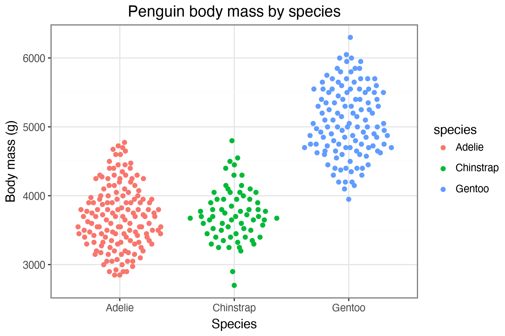

# plotnine-beeswarm

`plotnine-beeswarm` provides beeswarm-style geoms for [plotnine](https://plotnine.org/), modelled after the R [ggbeeswarm](https://github.com/eclarke/ggbeeswarm) package.

```python
import plotnine as p9
from plotnine.data import penguins
from plotnine_beeswarm import geom_quasirandom

penguins_plot = (
    p9.ggplot(penguins.dropna(subset=["species", "body_mass_g"]),
              p9.aes("species", "body_mass_g", color="species"))
    + geom_quasirandom(width=0.35)
    + p9.labs(
        title="Penguin body mass by species",
        x="Species",
        y="Body mass (g)",
    )
    + p9.theme_bw()
)
```

Rendered output:



Regenerate the figure with:

```sh
uv run --extra test python scripts/update_readme_figure.py
```

The package is managed with [uv](https://docs.astral.sh/uv/):

```sh
uv run --extra test pytest
```

The public Python compatibility module for the upstream
[vipor](https://github.com/sherrillmix/vipor) helpers is available as
`vipor`. It includes `offsetX`, `offsetSingleGroup`, the Tukey distribution
helpers, and the van der Corput utilities used by ggbeeswarm:

```python
from vipor import offsetX

offsets = offsetX(values, groups, method="quasirandom")
```

Tests mirroring vipor's upstream testthat suite are kept separately in
[tests/upstream_vipor](tests/upstream_vipor). The R-backed compatibility
checks use `rpy2` when the R vipor package is installed. Type-check the module
and those tests with:

```sh
uv run --extra test mypy src/vipor tests/upstream_vipor
```

The translated ggbeeswarm README examples and their visual regression tests
are in [tests/test_examples.py](tests/test_examples.py). To intentionally
regenerate the checked-in baselines after a rendering change, run:

```sh
P9BEESWARM_GENERATE_BASELINES=1 uv run --extra test pytest tests/test_examples.py
```

Visual test results are written to a temporary directory by default. To keep
them for manual inspection, choose an output directory explicitly:

```sh
uv run --extra test pytest tests/test_examples.py \
  --visual-result-dir=/tmp/plotnine-beeswarm-results
```
